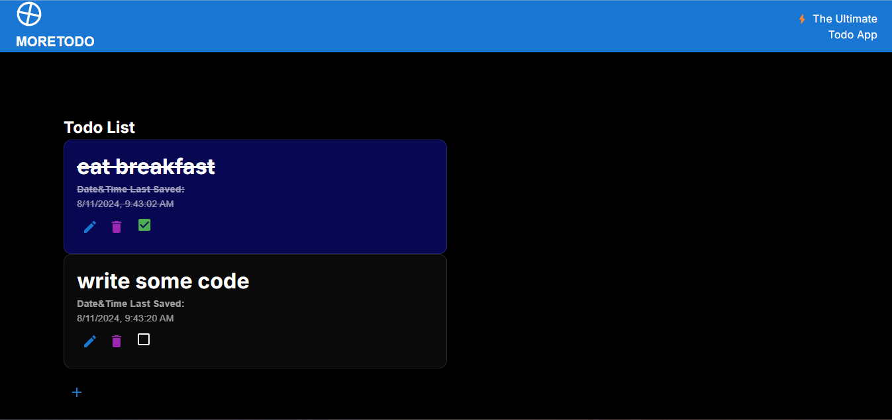

# What MORETODO is

Moretodo is an advanced todo app that reminds you one of David Akins' quotes:

> There's always something more to do.

David Akins believes that even though a "todo app" might _sound_ simple just by hearing it, MORETODO is the ultimate todo app.



World-class UI, legendary styling, amazing UI messages.

So why not just try the app out today?

# Usage

First, make sure you have the latest version of [NodeJS](https://nodejs.org/) installed.

Next, open your terminal and type:

```
git clone https://github.com/gooddavvy/moretodo.git
cd moretodo
npm i
npm run dev
```

After that, open `http://localhost:3000` and try out the app! If you like the app, please star this repo!

Oh, and don't forget: **There's always something more to do.**
